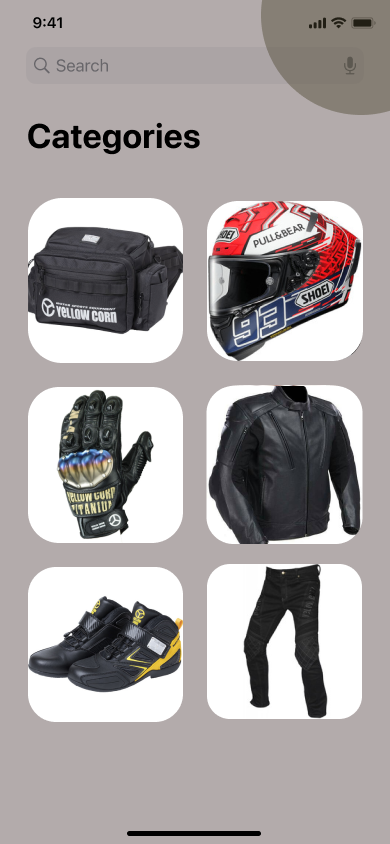

|  Ziddan Makarim  |     312010063      |
|------------------|--------------------|
|     TI.20 D.1    | Pemrograman Mobile |


## 1. ActivityMain
```
<?xml version="1.0" encoding="utf-8"?>
<RelativeLayout xmlns:android="http://schemas.android.com/apk/res/android"
    xmlns:app="http://schemas.android.com/apk/res-auto"
    xmlns:tools="http://schemas.android.com/tools"
    android:layout_width="match_parent"
    android:layout_height="match_parent"
    tools:context=".MainActivity">

    <View   android:id="@+id/_bg__slash_screen"
        android:background="@drawable/slashscreen"
        android:layout_marginStart="0dp"
        android:layout_marginTop="0dp"
        android:layout_width="420dp"
        android:layout_height="844dp" />

</RelativeLayout>
```
### Output


## 2. ActivityLogin
```
<?xml version="1.0" encoding="utf-8"?>
<RelativeLayout xmlns:android="http://schemas.android.com/apk/res/android"
    xmlns:app="http://schemas.android.com/apk/res-auto"
    xmlns:tools="http://schemas.android.com/tools"
    android:layout_width="match_parent"
    android:layout_height="match_parent"
    tools:context=".LoginActivity">

    <View   android:id="@+id/_bg__slash_screen"
        android:background="@drawable/login"
        android:layout_marginStart="0dp"
        android:layout_marginTop="0dp"
        android:layout_width="420dp"
        android:layout_height="844dp" />

</RelativeLayout>
```

### Output


## 3. ActivityHome
```
<?xml version="1.0" encoding="utf-8"?>
<RelativeLayout xmlns:android="http://schemas.android.com/apk/res/android"
    xmlns:app="http://schemas.android.com/apk/res-auto"
    xmlns:tools="http://schemas.android.com/tools"
    android:layout_width="match_parent"
    android:layout_height="match_parent"
    tools:context=".HomeActivity">

    <View   android:id="@+id/_bg__slash_screen"
        android:background="@drawable/home"
        android:layout_marginStart="0dp"
        android:layout_marginTop="0dp"
        android:layout_width="411dp"
        android:layout_height="733dp" />

</RelativeLayout>
```
### Output



